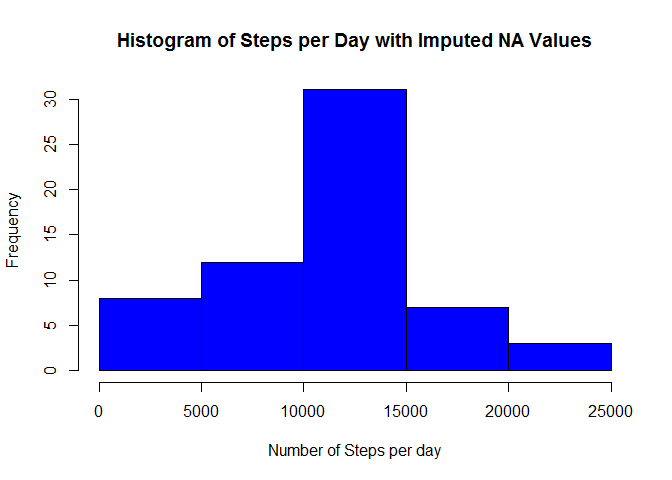

# Reproducible Research Project 1
This report will perform a basic analysis of data from a personal activity monitoring device. The [data](https://d396qusza40orc.cloudfront.net/repdata%2Fdata%2Factivity.zip) consists of the number of steps taken for each five minute interval during a two-month period for one subject. 

**Loading and preprocessing the data**

The file "activity.csv" is loaded into the data frame _activitydata_ and the variable _date_ is changed from a factor variable to a Date variable.


```r
activitydata<-read.csv("activity.csv")
activitydata$date<-as.Date(activitydata$date)
```

**What is mean total number of steps taken per day?**

The total number of steps taken per day over the two-month period is:


```r
stepsperday<-tapply(activitydata$steps,activitydata$date,sum,na.rm=TRUE)
stepsperday
```

```
## 2012-10-01 2012-10-02 2012-10-03 2012-10-04 2012-10-05 2012-10-06 
##          0        126      11352      12116      13294      15420 
## 2012-10-07 2012-10-08 2012-10-09 2012-10-10 2012-10-11 2012-10-12 
##      11015          0      12811       9900      10304      17382 
## 2012-10-13 2012-10-14 2012-10-15 2012-10-16 2012-10-17 2012-10-18 
##      12426      15098      10139      15084      13452      10056 
## 2012-10-19 2012-10-20 2012-10-21 2012-10-22 2012-10-23 2012-10-24 
##      11829      10395       8821      13460       8918       8355 
## 2012-10-25 2012-10-26 2012-10-27 2012-10-28 2012-10-29 2012-10-30 
##       2492       6778      10119      11458       5018       9819 
## 2012-10-31 2012-11-01 2012-11-02 2012-11-03 2012-11-04 2012-11-05 
##      15414          0      10600      10571          0      10439 
## 2012-11-06 2012-11-07 2012-11-08 2012-11-09 2012-11-10 2012-11-11 
##       8334      12883       3219          0          0      12608 
## 2012-11-12 2012-11-13 2012-11-14 2012-11-15 2012-11-16 2012-11-17 
##      10765       7336          0         41       5441      14339 
## 2012-11-18 2012-11-19 2012-11-20 2012-11-21 2012-11-22 2012-11-23 
##      15110       8841       4472      12787      20427      21194 
## 2012-11-24 2012-11-25 2012-11-26 2012-11-27 2012-11-28 2012-11-29 
##      14478      11834      11162      13646      10183       7047 
## 2012-11-30 
##          0
```

```r
hist(stepsperday,col="blue",xlab="Number of Steps per day",main="Histogram of Steps per Day")
```


The mean and median number of steps taken per day over the two-month period are (respectively):


```r
mean(stepsperday)
```

```
## [1] 9354.23
```

```r
median(stepsperday)
```

```
## [1] 10395
```

**What is the average daily activity pattern?**

Provided below is a plot of the mean number of steps taken per 5-minute interval averaged over all days along with the maximum value and the beginning of the corresponding 5-minute interval.


```r
intervalmeans<-as.numeric(tapply(activitydata$steps,activitydata$interval,mean,na.rm=TRUE))
intervalmeans<-data.frame(interval=activitydata$interval[1:288],meansteps=intervalmeans)
plot(intervalmeans,type = "l",ylab = "Average Steps (across all days)",xlab = "Interval",
     main = "Average Number of Steps per 5-Minute Interval",lwd=1)
```


```r
max(intervalmeans$meansteps,na.rm = TRUE)
```

```
## [1] 206.1698
```

```r
intervalmeans$interval[which.max(intervalmeans$meansteps)]
```

```
## [1] 835
```

**Imputing missing values**

The total number of missing values in the dataset are:


```r
sum(is.na(activitydata$steps))
```

```
## [1] 2304
```

Missing values will be imputed by using the mean value for the corresponding interval. A histogram of the number of steps per day with imputed values is provided, along with the mean and median for the imputed dataset and the change in the mean and median from the original dataset.


```r
activitydata2<-activitydata
temp<-merge(intervalmeans,activitydata[is.na(activitydata),])
temp2<-order(temp$interval,temp$date)
temp<-temp[temp2,]
activitydata2$steps[is.na(activitydata$steps)]<-temp$meansteps

stepsperday2<-tapply(activitydata2$steps,activitydata2$date,sum,na.rm=TRUE)
hist(stepsperday2,col="blue",xlab="Number of Steps per day",
     main="Histogram of Steps per Day with Imputed NA Values")
```



```r
mean(stepsperday2)
```

```
## [1] 10766.19
```

```r
median(stepsperday2)
```

```
## [1] 11015
```

```r
mean(stepsperday2)-mean(stepsperday)
```

```
## [1] 1411.959
```

```r
median(stepsperday2)-median(stepsperday)
```

```
## [1] 620
```

**Are there differences in activity patterns between weekdays and weekends?**


```r
activitydata2$weekday<-weekdays(activitydata2$date)
wtest<-activitydata2$weekday=="Saturday" | activitydata2$weekday=="Saturday"
activitydata2$weekday<-factor(wtest,labels=c("WEEKDAY","WEEKEND"))
library(ggplot2)
```

```
## Warning: package 'ggplot2' was built under R version 3.2.4
```

```r
ggplot(activitydata2, aes(interval, steps)) + stat_summary(geom = "line", fun.y = "mean", size = 1) + facet_grid(weekday~.) + ggtitle("Mean Steps per Interval")
```


